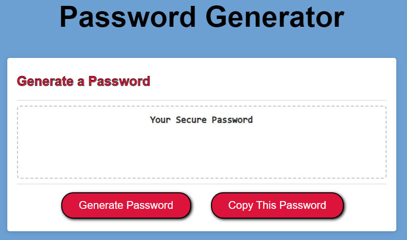
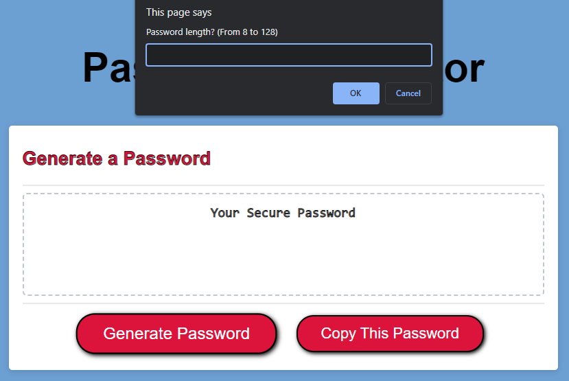
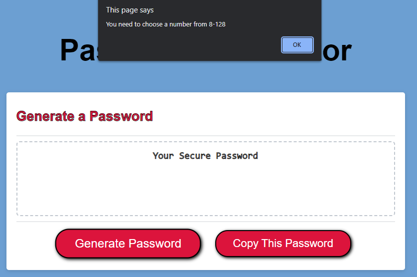
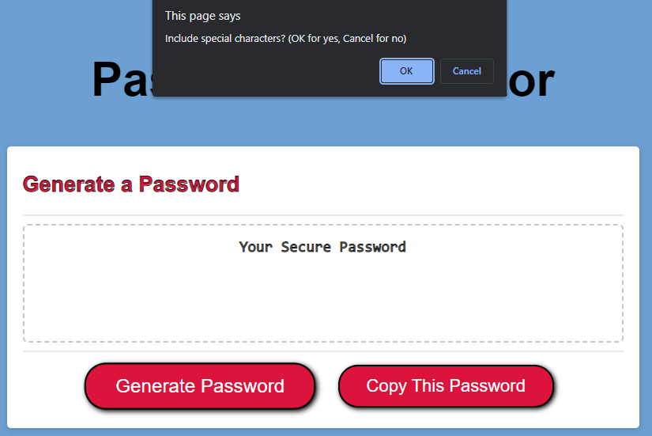
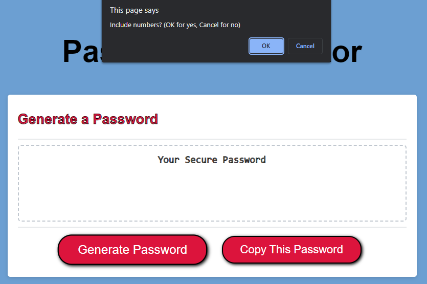
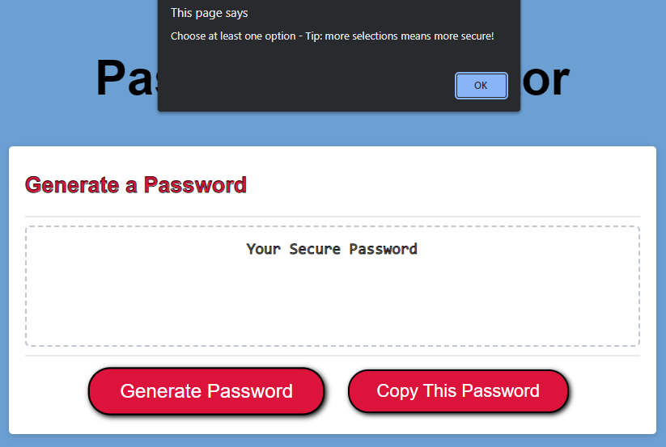
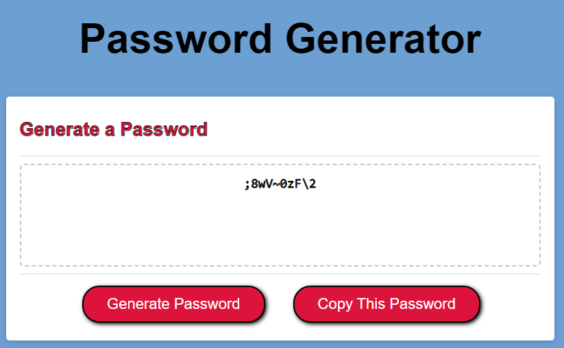
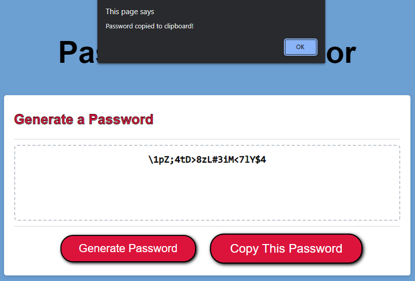

# password-generator

https://jaxpi.github.io/Professional-Portfolio/

## Description

This is a random password generator that provides the user with a password containing the selected criteria (special characters, numbers, lowercase letters, and/or uppercase letters) at the selected length (from 8 to 128 characters).

This was created to provide employees with access to sensitive data the ability to generate a strong password for greater security.

Some issues that arose were ensuring that the user would not have to re-select options if a mistake was made, and ensuring that each of the selected criteria were included in the generated password.

## Usage

First the user clicks on "generate password" and is prompted to choose a password length.

The user types in a number from 8 to 128. If the user does not input a value, or inputs a value less than 8 or greater than 128, a message will show reminding the user that the number they input must be from 8 to 128.

When the user inputs a valid number they will then be prompted with options to include special characters, numbers, lowercase letters, and uppercase letters.

Since these are the only options, if a user chooses not to include all four options, a message will show to remind the user that they must choose at least one criterion.

When at least one criterion is selected then a randomized password will be generated and will display on the screen.

The user can then click on "Copy This Password" to copy the generated password to their clipboard for insertion into a file or webpage.

## License

MIT License

Copyright (c) [year] [fullname]

Permission is hereby granted, free of charge, to any person obtaining a copy
of this software and associated documentation files (the "Software"), to deal
in the Software without restriction, including without limitation the rights
to use, copy, modify, merge, publish, distribute, sublicense, and/or sell
copies of the Software, and to permit persons to whom the Software is
furnished to do so, subject to the following conditions:

The above copyright notice and this permission notice shall be included in all
copies or substantial portions of the Software.

THE SOFTWARE IS PROVIDED "AS IS", WITHOUT WARRANTY OF ANY KIND, EXPRESS OR
IMPLIED, INCLUDING BUT NOT LIMITED TO THE WARRANTIES OF MERCHANTABILITY,
FITNESS FOR A PARTICULAR PURPOSE AND NONINFRINGEMENT. IN NO EVENT SHALL THE
AUTHORS OR COPYRIGHT HOLDERS BE LIABLE FOR ANY CLAIM, DAMAGES OR OTHER
LIABILITY, WHETHER IN AN ACTION OF CONTRACT, TORT OR OTHERWISE, ARISING FROM,
OUT OF OR IN CONNECTION WITH THE SOFTWARE OR THE USE OR OTHER DEALINGS IN THE
SOFTWARE.
